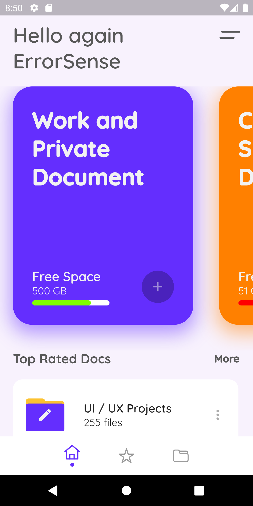
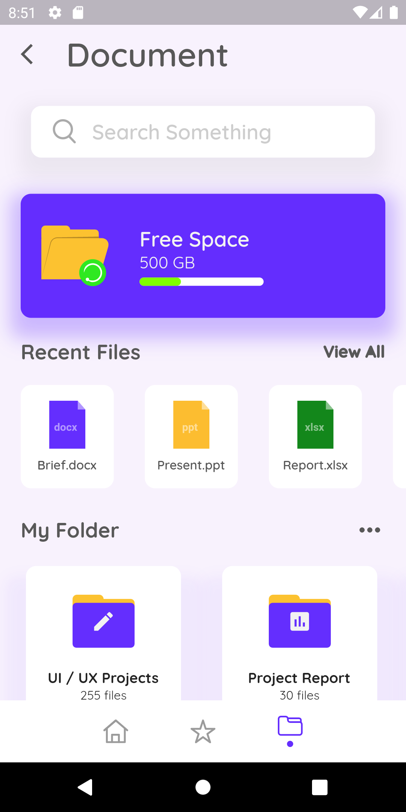

# Cloud Docs

Flutter UI for handling Documens in Cloud

## Screenshots

Here is a screenshot of the app:





## Getting Started

To run this app, you will need the Flutter SDK.

1. [Install Flutter](https://flutter.dev/docs/get-started/install)
2. Clone this repository
3. Download [Font](https://fonts.google.com/specimen/Quicksand?preview.text=My+Orders&preview.text_type=custom&query=quick
) in:
```yaml
fonts:
  - family: Quicksand
    fonts:
      - asset: assets/fonts/Quicksand-Regular.ttf
      - asset: assets/fonts/Quicksand-Medium.ttf
        weight: 700
      - asset: assets/fonts/Quicksand-SemiBold.ttf
        weight: 800
      - asset: assets/fonts/Quicksand-Bold.ttf
        weight: 900
```
4. Navigate to the project directory in your terminal
5. Run `flutter run` to start the app

## Dependencies

```yaml
dependencies:
  flutter:
    sdk: flutter
  cupertino_icons: ^1.0.2
  flutter_svg: ^1.1.6
```


## Credits

- [Flutter](https://flutter.dev)
- [Dart](https://dart.dev)
